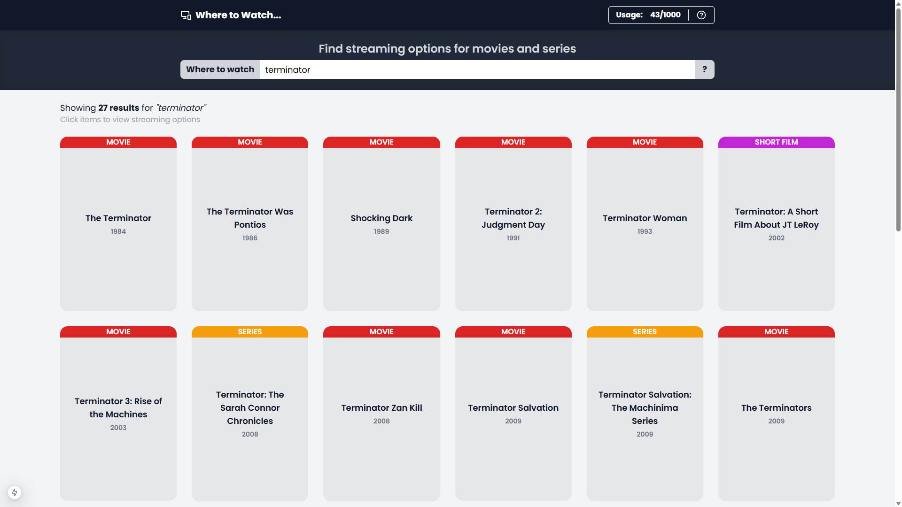

<h1 align="center">Where to Watch – Streaming Availability Finder</h1>

<div align="center">

[]()


[](./LICENSE)

</div>

<div align="center">



</div>

## Description

A web application that helps users discover where movies and TV series are available for streaming in Brazil. Integrates with the Watchmode API to provide real-time streaming availability across multiple platforms including Netflix, Prime Video, Disney+, Max, and others.

## Features

- Search for movies, series, short films, and TV specials by title
- View detailed streaming availability with pricing information
- See subscription, rental, and purchase options side by side
- Filter results by content type (movies, series, miniseries, shorts)
- Access direct links to streaming platforms
- Optional custom API key configuration for personal usage quotas
- Bilingual interface (English and Portuguese)
- Responsive design for desktop and mobile devices

## Tech Stack

**Frontend**
- Next.js 15 (App Router)
- React 19
- Chakra UI v3
- Tailwind CSS
- i18next (internationalization)

**Backend**
- Next.js API Routes
- Watchmode API integration

**Tooling**
- ESLint
- Biome
- Turbopack (development)
- Vercel Analytics

## Getting Started

### Prerequisites

- Node.js (see `package.json` for compatible versions)
- npm or compatible package manager

### Installation

```bash
npm install
```

### Environment Setup

Copy the example environment file and configure your API credentials:

```bash
cp .env.example .env.local
```

Edit `.env.local` with your Watchmode API key:

```
BASE_URL=https://api.watchmode.com/v1
WATCHMODE_API_KEY=your_api_key_here
```

Obtain a free API key at [https://api.watchmode.com/requestApiKey](https://api.watchmode.com/requestApiKey).

### Running the Project

```bash
npm run dev
```

Open [http://localhost:3000](http://localhost:3000) in your browser.

## Available Scripts

| Command | Description |
|---------|-------------|
| `npm run dev` | Start development server with Turbopack |
| `npm run build` | Create production build |
| `npm run start` | Start production server |
| `npm run lint` | Run ESLint |

## API

The application provides the following API endpoints:

- `GET /api/search?searchedTitle={name}` - Search for titles by name
- `GET /api/details?titleId={id}` - Get streaming availability details for a specific title
- `GET /api/validate-key?apiKey={key}` - Validate a custom Watchmode API key

## Project Structure

```
app/
├── api/              # API route handlers
│   ├── search/       # Title search endpoint
│   ├── details/      # Streaming details endpoint
│   └── validate-key/ # API key validation endpoint
├── page.jsx          # Main search page
├── layout.js         # Root layout
└── globals.css       # Global styles

components/
├── ui/               # Chakra UI component wrappers
├── Header.jsx        # Application header
├── Search.jsx        # Search input component
├── TitleCard.jsx     # Title result card
├── TitleDetails.jsx  # Streaming options modal
├── RateLimitContext.jsx  # API usage state management
├── RateLimitCounter.jsx  # Usage quota display
└── ApiKeyDialog.jsx  # Custom API key configuration

locales/
└── resources.js      # i18n translations (EN/PT)
```

## Support

For issues and feature requests, please use [GitHub Issues](https://github.com/MllGll/where-to-watch/issues).

**Contact**

Marcello Gallante  
Email: [marcellogallante@gmail.com](mailto:marcellogallante@gmail.com)

## Authors

- **Marcello Gallante** - [GitHub](https://github.com/MllGll)

## License

This project is licensed under the MIT License. See [LICENSE](./LICENSE) for details.
